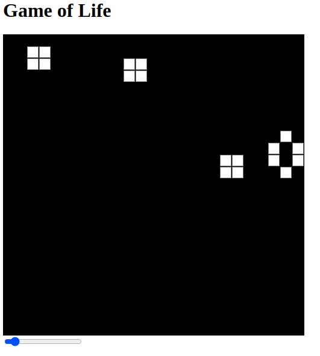

# Conway's Game of life

## Brief

This is a  vary simplistic implementation of conway's game of life.

Currently, it starts by initializing a random grid, and you can see how generations evolve. 

and you can vary the speed in which the screen updates using the slider at the bottom.

## Whats Next ? 

- [ ] support changing the screen resolution
- [ ] support adding custom layout;
- [ ] support pausing/starting screen updates
- [ ] support cell age -- using shades of gray
- [ ] making a more interactive layout
- [ ] Recreate the game from scratch without p5
